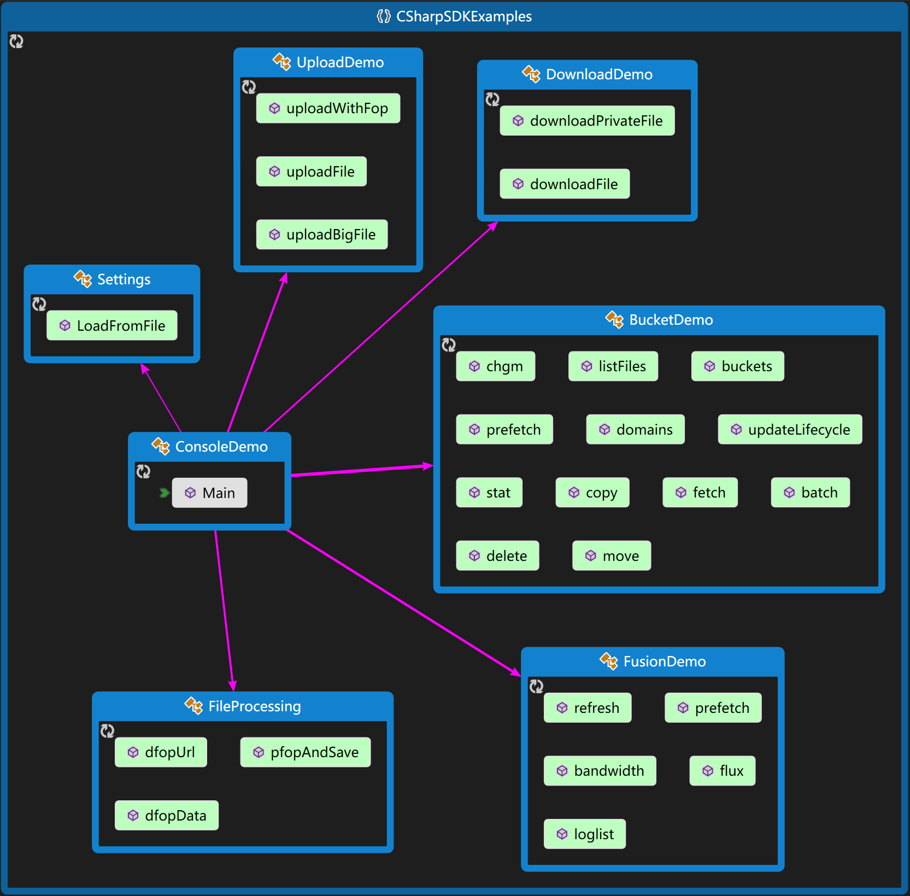

** Qiniu (Storage) C# SDK Examples** 

如何编译？

首先请执行projects文件夹下的`project-clear.cmd`和`project-xxx.cmd`

| 目标 | 命令文件 | 备注 |
|--------|--------|--------|
| .NET Framework 2.0+ | project-nfx2.0.cmd |  |
| .NET Framework 4.0+ | project-nfx4.0.cmd |  |
| .NET Framework 4.5+ | project-nfx4.5.cmd |  |
| .NET Core | project-dnc1.6.cmd | netstandard1.6.0 |

然后在Visual Studio中打开csharp-sdk-examples.sln

